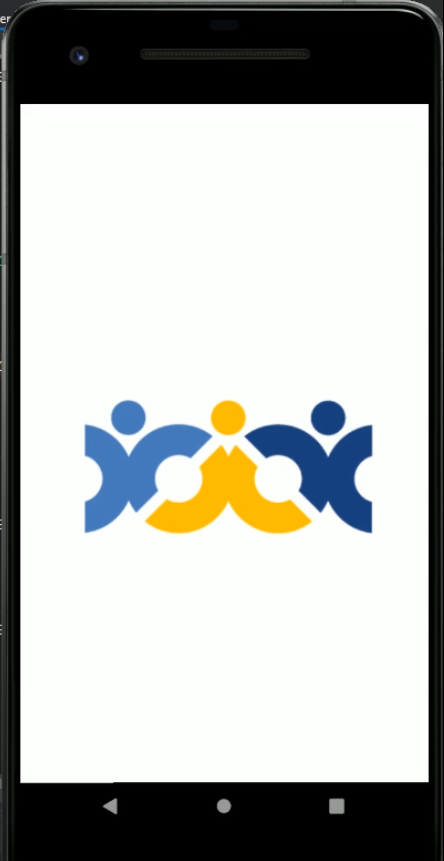
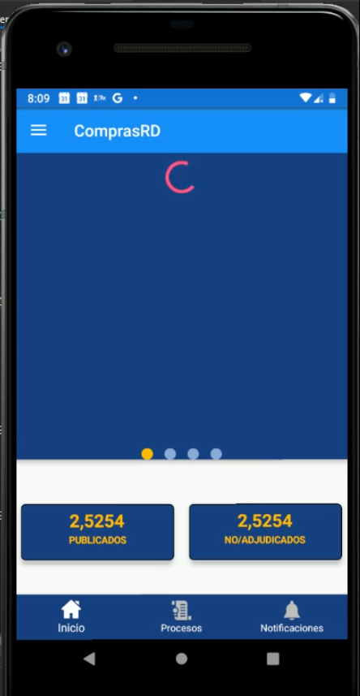
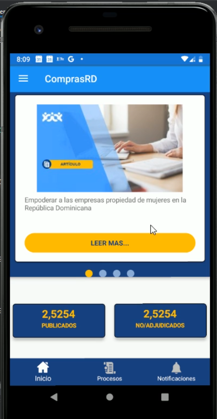
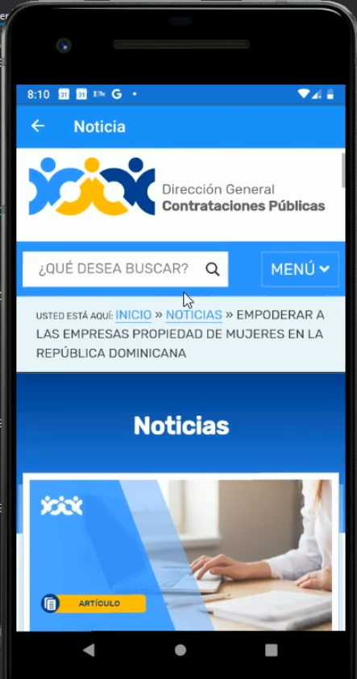
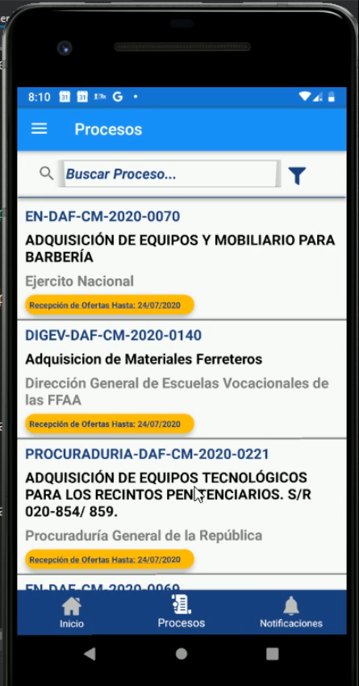
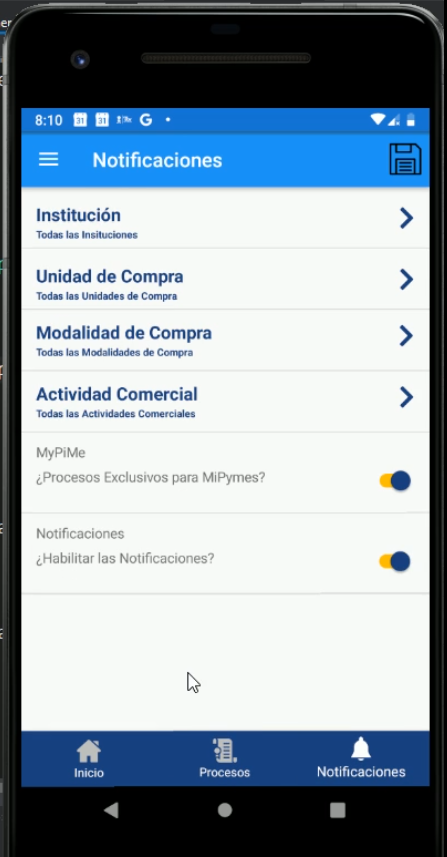
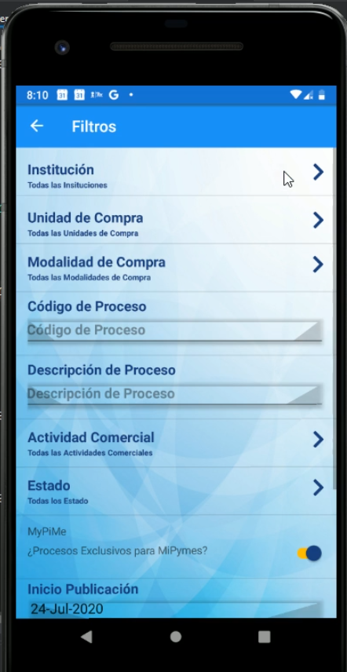
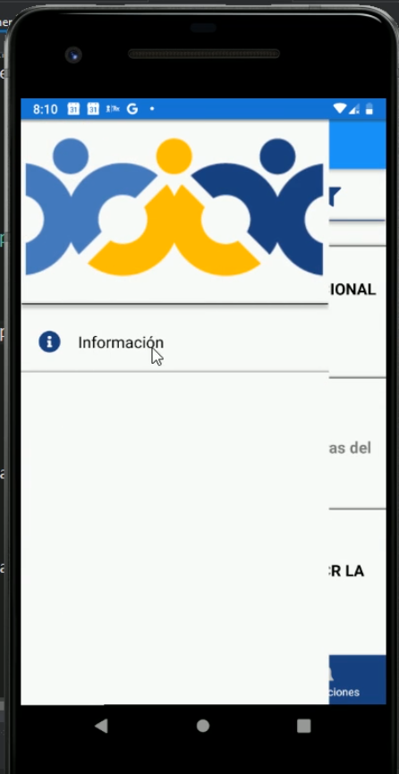
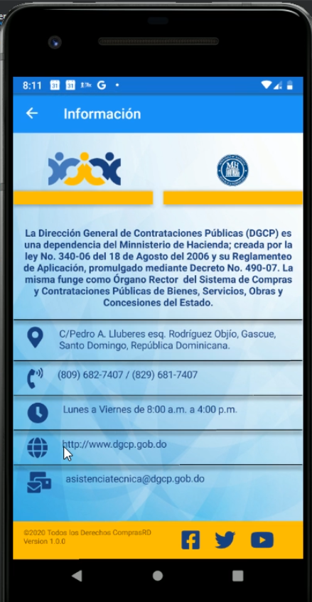

# Develop and maintain a mobile application in xamarin

The goal was to develop and maintain a mobile application for
 that providers can see news information relevant to the DGCP, a list of processes, articles of processes, Notifications when a new process is published, list of Institutions of the Dominican State, among other things.

Technology used:
* IDE: **Visual Studio 2019 Community**
* App: **Xamarin Mobile Application**
* Architecture: **MVVM (Model-View-ViewModel)**
* Framework: **Prism Library**
* Language: **C# / Framework 4.5**
* Notifications: **Push Notifications (GCM) android**
* Database: **SQLite**

To carry out this task, I created a mobile application in xamarin where I used the prism library to facilitate some actions such as navigation between views.

The application allowed you to see the relevant news from the DGCP, get notifications about new published processes, a list of institutions, and check the status of your user, among other things.

To send notifications, I had a window task programmed that would run every 15 minutes, with a curl command which executed a notification endpoint. that endpoint searched for new processes and sent through Android Push Notifications (GCM) to all users of the mobile app the notice of a new publication of processes.

##### Screenshots of the System

